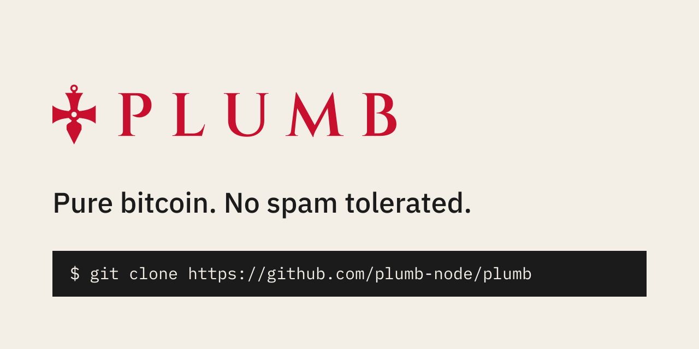

Plumb is Bitcoin Knots plus the spam-policy filters the Plumb maintainers
have reviewed and ACKed, whether they were opened against Knots or here, and
whether or not Knots merges them. Each release is one Knots release plus
those merges and nothing else.

It is a policy project, not a consensus project. The filters change what
your node relays and what your node mines. They do not change which blocks
are valid, so Plumb follows the same chain as the Knots release it is built
on.

It is a drop-in replacement for Knots: same `bitcoind` and `bitcoin-cli`
binaries, same `bitcoin.conf`, same data directory. You can switch back to
Knots at any time.

What Plumb ships
----------------

<!-- filters:start -->
- **[Fake output hashes and keys](plumb/FILTERS.md#fake-output-hashes-and-keys)**, `-rejectfakeoutputs`, from [knots#389](https://github.com/bitcoinknots/bitcoin/pull/389): counts outputs whose hash or key is data as data carrier bytes.
- **[Dead conditional branches](plumb/FILTERS.md#dead-conditional-branches)**, `-rejectdeadbranches`, from [knots#400](https://github.com/bitcoinknots/bitcoin/pull/400): counts data in a conditional branch that constants make unreachable.
- **[Bare data envelopes](plumb/FILTERS.md#bare-data-envelopes)**, `-rejectbareenvelopes`, from [knots#319](https://github.com/bitcoinknots/bitcoin/pull/319): counts a run of pushes ended by OP_DROP or OP_2DROP as data carrier bytes.

Every filter is on by default and is its own option. [plumb/FILTERS.md](plumb/FILTERS.md)
says what each one rejects and leaves alone, with an example transaction and
the line that turns it off. `-corepolicy` turns all of them off along with the
rest of the Knots policy. The node logs which filters are active at startup:

```
Plumb filter -rejectfakeoutputs=1 (knots#389)
Plumb filter -rejectdeadbranches=1 (knots#400)
Plumb filter -rejectbareenvelopes=1 (knots#319)
```
<!-- filters:end -->

The machine-readable list is [plumb/filters.json](plumb/filters.json), with
the exact commit of each pull request that was merged.

Getting it
----------

Plumb is distributed as source. Releases are signed git tags named after the
Knots release they are built on, for example `v29.4.2.knots20260508.plumb1`.

```sh
git clone https://github.com/plumb-node/plumb
cd plumb
git checkout v29.4.2.knots20260508.plumb1
git verify-tag v29.4.2.knots20260508.plumb1
cmake -B build -DBUILD_GUI=OFF
cmake --build build -j"$(nproc)"
```

Tags are signed by Jason Sopko,
`89F0 E41D 72CE 523F 4AA1  CDB6 92CD FFB7 C40C D1BA`. Fetch the key with
`gpg --keyserver hkps://keys.openpgp.org --recv-keys 89F0E41D72CE523F4AA1CDB692CDFFB7C40CD1BA`
or from https://github.com/jasonsopko.gpg.

Build dependencies and options are the same as Knots; see
[doc/build-unix.md](doc/build-unix.md) and the other `doc/build-*.md` files.
The binaries land in `build/bin/`.

To hear about new releases, use Watch, Custom, Releases on this repository.
Each release page lists what changed and the Knots release underneath it.

Submitting a filter
-------------------

Plumb takes anti-spam policy filters as pull requests on this repository. If
you have one open against Knots, open it here too and link the two; we
review it on its own merits and keep shipping it whatever happens upstream.
A filter that Knots closes stays in Plumb.

What a filter needs:

1. Its own option, default on, turned off by `-corepolicy`, the same shape
   as `-rejectparasites`.
2. Unit or functional tests for what it rejects and what it lets through.
3. Numbers from the chain: how many transactions it would have rejected
   over a stated block range, and a look at the ones that might be payments.
   A filter that blocks ordinary wallet spends does not ship, however much
   data it catches.

We review it on the pull request, run it on a mainnet node, and post the
ACK there. It is merged at the commit that was ACKed and kept on its own
`filter/<option>` branch here, so it survives even if the author's branch
goes away. If the author stops maintaining it, we carry it forward to each
new Knots release ourselves.

Found a new embedding shape but have no code for it? Open an issue with the
"Embedding shape" form and a transaction id or two.

See [plumb/MAINTAINING.md](plumb/MAINTAINING.md) for the merge and release
process.

Reporting problems
------------------

Report Plumb problems [here](https://github.com/plumb-node/plumb/issues),
not to Knots. If a problem also happens on the Knots release underneath,
it belongs upstream at https://github.com/bitcoinknots/bitcoin. Security
issues go through [SECURITY.md](SECURITY.md).

License
-------

Plumb is released under the terms of the MIT license, the same as Bitcoin
Knots and Bitcoin Core. See [COPYING](COPYING). It is built on the work of
the Bitcoin Core and Bitcoin Knots developers; see https://bitcoinknots.org
for Knots itself.
